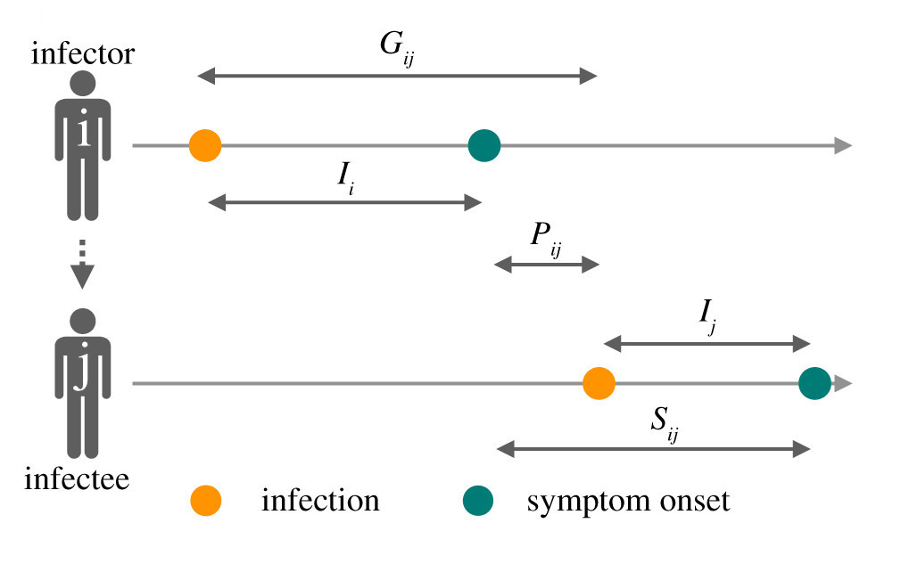

```{=html}
<style type="text/css">
.main-container {
  max-width: 750px;
  margin-left: auto;
  margin-right: auto;
}
</style>
```

```{css, echo=FALSE}
.plotlysize {
  height: 220px;
```

```{r setup, include=FALSE}
knitr::opts_chunk$set(echo = TRUE)
library(plotly)
library(purrr)
library(shiny)
library(splines)
library(tidyverse)
options(shiny.plot.res=96)
```

This document walks through the steps of simulating estimates of the instantaneous reproduction number, $R(t)$, which can be helpful for surveillance and intervention planning of infectious diseases. 

Throughout, we define $R(t)$ as the instantaneous reproduction number defined in [Gostic et. al. (2020)](https://journals.plos.org/ploscompbiol/article?id=10.1371/journal.pcbi.1008409), "The **instantaneous reproductive number** measures transmission at a specific point in time, [and] is more appropriate for analyses estimating the reproductive number of the infected population on specific dates, especially when aiming to study how interventions or other extrinsic factors have affected transmission at a given point in time."

To do this, we'll simulate **line-list data**, which means there is a single row for each case that has dates for: infection, symptom onset, and when the case was reported to public health agencies.

In this document, we use the following terms from [Lehtinen et. al. (2021)](https://royalsocietypublishing.org/doi/10.1098/rsif.2020.0756):

```{r pressure, echo=FALSE, fig.cap="Figure 1 from Lehtinen et. al. (2021)", out.width = '60%'}

```

* $G_{ij}$ is the generation time, the time between infection in i and infection in j
* $I_i$ is the incubation time, between infection and sympton onset
* $P_{ij}$ is the transmission time, defined as the time between symptom onset in i and infection in j
* $S_{ij}$ is the serial interval, the time between sympton onset in i and symptom onset in j

**NOTE:** Each of these is in reference to the **infector**, so the **infector** ($i$) has a serial interval and a generation interval that is applied to each **infectee** ($j$). This is very important for calculation of the true $R(t)$ from a single simulation.

For this simulation, we take several steps to simulate how cases spread from one person to another: 

1. Simulate the individual-level incubation time distribution, then 
2. Simulate the individual-level transmission time distribution (assumed to be independent from the incubation time distribution). 

We then can derive distributions for the generation time and serial interval using the relationships described in [Lehtinen et. al. (2021)](https://royalsocietypublishing.org/doi/10.1098/rsif.2020.0756):

3. Simulate the individual-level administrative delay in reporting, and 
4. Simulate the population-level infectivity dynamics. 

The result is simulated individual line-list and aggregated count data. 

For reproducibility, we fix the random seed.

```{r seed_set, echo = F}
inputPanel(shiny::helpText("set.seed(123)"))
set.seed(123)
```

##### Assumptions

We make several assumptions on this sheet:

* We parameterize all distributions using right-truncated Negative Binomial (NB) distributions. Throughout, NB size is a measure of distribution dispersion (smaller size means more over-dispersion, which means variance != mean. Higher size means the distribution gets closer to Poisson). For more information see [Zeileis](https://edoc.unibas.ch/15400/).
* Offspring in each generation can be described using either a Poisson or NB distribution with a defined NB size parameter.
* We assume that infectivity happens on the day of symptom onset. 
* We assume that the incubation and transmission distributions are independent. 

#### Acknowledgements

This page was developed in preparation for the InsightNet Collabathon, Sept 24-26 in Boston, MA, USA. We would like to acknowledge the funding from EpiStorm (CDC NU38FT000013), as well as contributions of code and thoughts from Tenglong Li, PhD^[Boston University, School of Public Health, Department of Biostatistics], Zhenwei Zhou, PhD^[Boston University, School of Public Health, Department of Biostatistics], Christine Sangphet, BA^[Boston University], and Anne Cori, PhD^[Imperial College, London]. The code for this page is available on [Github](https://github.com/cmilando/RtEval).

### Incubation time distribution
Incubation time is defined as the time between **infection** and **symptom onset** for an individual. We used a minimum incubation time (1 day) and a maximum incubation time (user defined). Incubation of exactly 1 day can be achieved by setting NB size = 1e-10. 

```{r inc_interval, echo=FALSE}
INC_MIN = 1

## INPUTS
inputPanel(
  # row 1
  sliderInput("inc_i_mean", label = "NB mean (days)", value = 2, min = 1, max = 15),
  sliderInput("inc_i_size", label = "NB size", pre = '1e', value = 2, min = -10, max = 10),
  sliderInput("maxinc", label = "Max. incubation time (days)", value = 11,
              min = 5, max = 15, step = 1)
)

inc_data <- reactive({
  data.frame(x = sample(0:input$maxinc, 
                          size = 5000, 
                          prob = dnbinom(0:input$maxinc, 
                                         size = 1*10^input$inc_i_size, 
                                         mu = input$inc_i_mean), 
                          replace = TRUE) + INC_MIN ) %>%
      group_by(x) %>% tally() %>%
    mutate(n = n / sum(n)) 
})

inc_max <- reactive({ max(as_tibble(inc_data())$n) })
```

```{r plot1, echo=F, out.width="100%"}
renderPlot({
    as_tibble(inc_data()) %>%
    ggplot(.,aes(x = x, y = n)) +
      geom_col(fill = 'white', color = 'black',
           width = 0.4) +
  geom_density(stat = 'identity', fill = '#FF6666', alpha = 0.2) +
    # geom_density(data = data.frame(x = rpois(5000, input$inc_i_mean)) %>%
    #                group_by(x) %>% tally() %>% mutate(n = n / sum(n)) ,
    #              aes(x = x + INC_MIN, y= n),
    #              stat = 'identity', fill = NA, color = 'blue', alpha = 0.2) +
    coord_cartesian(xlim = c(0, 15), ylim = c(0, as_vector(inc_max()))) +
    scale_x_continuous(minor_breaks = 1:15) +
    xlab('Days') + ylab('P(x)') +
    theme(
      axis.text = element_text(size = 10),
          axis.title = element_text(size = 14)
    )
}, height = 200)

```

### Transmission time distribution
Transmission time is defined as the time beteween between **symptom onset** in **infector** and **infection** in **infectee** for an individual. In this simulation we assume that the transmission time distribution is **independent** from the incubation time distribution. We parameterized using a right-truncated Negative Binomial (NB) distribution defined by a minimum transmission time (0 days) and a maximum transmission time (user defined). Transmission of exactly 0 days can be achieved by setting NB mean = 0, or NB size = 1e-10. 

```{r trans_interval, echo=FALSE}
TRANS_MIN = 0

## INPUTS
inputPanel(
  # row 1
  sliderInput("trans_i_mean", label = "NB mean (days)", value = 1, min = 0, max = 15),
  sliderInput("trans_i_size", label = "NB size", pre = '1e', value = 2, min = -10, max = 10),
  sliderInput("maxtrans", label = "Max. transmission time (days)", value = 10,
              min = 5, max = 15, step = 1),
)

trans_data <- reactive({
      data.frame(x = sample(0:input$maxtrans, 
                          size = 5000, 
                          prob = dnbinom(0:input$maxtrans, 
                                         size = 1*10^input$trans_i_size, 
                                         mu = input$trans_i_mean), 
                          replace = TRUE) + TRANS_MIN ) %>%
      group_by(x) %>% tally() %>%
    mutate(n = n / sum(n)) 
})

trans_max <- reactive({ max(as_tibble(trans_data())$n) })

renderPlot({
    as_tibble(trans_data()) %>%
    ggplot() +
      geom_col(aes(x = x, y = n), fill = 'white', color = 'black',
           width = 0.4) +
  geom_density(aes(x = x, y = n), stat = 'identity', fill = '#FF6666', alpha = 0.2) +
        # geom_density(data = data.frame(x = rpois(5000, input$trans_i_mean)) %>%
        #            group_by(x) %>% tally() %>% mutate(n = n / sum(n)) ,
        #          aes(x = x + TRANS_MIN, y= n),
        #          stat = 'identity', fill = NA, color = 'blue', alpha = 0.2) +
    coord_cartesian(xlim = c(0, 15), ylim = c(0, as_vector(trans_max()))) +
    scale_x_continuous(minor_breaks = 1:15) +
    xlab('Days') + ylab('P(x)') +
    theme(
      axis.text = element_text(size = 10),
          axis.title = element_text(size = 14)
    )
}, height = 200)

```


### Derived Generation time distribution
Generation time is the time between **infection** in the **infector** and **infection** in the **infectee**, dervied as $G_{ij} = I_{i} + P_{ij}$ (Eq. 2.1b from [Lehtinen et. al. (2021)](https://royalsocietypublishing.org/doi/10.1098/rsif.2020.0756)). In this simulation we assume that the transmission time distribution is **independent** from the incubation time distribution, so the generation time distribution and serial interval distribution (below) are the same.

```{r gen_interval, echo=FALSE}

gen_data <- reactive({
      data.frame(x1 = sample(0:input$maxinc, 
                          size = 5000, 
                          prob = dnbinom(0:input$maxinc, 
                                         size = 1*10^input$inc_i_size, 
                                         mu = input$inc_i_mean), 
                          replace = TRUE) + INC_MIN,
               x2 = sample(0:input$maxtrans, 
                          size = 5000, 
                          prob = dnbinom(0:input$maxtrans, 
                                         size = 1*10^input$trans_i_size, 
                                         mu = input$trans_i_mean), 
                          replace = TRUE) + TRANS_MIN)     %>%
    mutate(x = x1 + x2) %>%
      group_by(x) %>% tally() %>%
    mutate(n = n / sum(n)) 
})

gen_max <- reactive({ max(as_tibble(gen_data())$n) })

renderPlot({
    as_tibble(gen_data()) %>%
    ggplot() +
      geom_col(aes(x = x, y = n), fill = 'white', color = 'black',
           width = 0.4) +
  geom_density(aes(x = x, y = n), stat = 'identity', fill = '#FF6666', alpha = 0.2) +
    coord_cartesian(xlim = c(0, 15), ylim = c(0, as_vector(gen_max()))) +
    scale_x_continuous(minor_breaks = 1:15) +
    xlab('Days') + ylab('P(x)') +
    theme(
      axis.text = element_text(size = 10),
          axis.title = element_text(size = 14)
    )
}, height = 200)

```


### Derived Serial interval distribution
The serial interval is derived from the generation time distribution and the incubation time distribution: $S_{ij} = P_{ij} + I_j$ (Eq. 2.1a from [Lehtinen et. al. (2021)](https://royalsocietypublishing.org/doi/10.1098/rsif.2020.0756)). In this simulation we assume that the transmission time distribution is **independent** from the incubation time distribution, so the serial interval distribution and generation time distribution (above) are the same.

```{r serial_interval, echo=FALSE}

serial_data <- reactive({
      data.frame(x1 = sample(0:input$maxinc, 
                          size = 5000, 
                          prob = dnbinom(0:input$maxinc, 
                                         size = 1*10^input$inc_i_size, 
                                         mu = input$inc_i_mean), 
                          replace = TRUE) + INC_MIN,
               x2 = sample(0:input$maxtrans, 
                          size = 5000, 
                          prob = dnbinom(0:input$maxtrans, 
                                         size = 1*10^input$trans_i_size, 
                                         mu = input$trans_i_mean), 
                          replace = TRUE) + TRANS_MIN)     %>%
    mutate(x = x1 + x2) %>%
      group_by(x) %>% tally() %>%
    mutate(n = n / sum(n))
})

serial_max <- reactive({ max(as_tibble(serial_data())$n) })

renderPlot({
    as_tibble(serial_data()) %>%
    ggplot() +
      geom_col(aes(x = x, y = n), fill = 'white', color = 'black',
           width = 0.4) +
  geom_density(aes(x = x, y = n), stat = 'identity', fill = '#FF6666', alpha = 0.2) +
    coord_cartesian(xlim = c(0, 15), ylim = c(0, as_vector(serial_max()))) +
    scale_x_continuous(minor_breaks = 1:15) +
    xlab('Days') + ylab('P(x)') +
    theme(
      axis.text = element_text(size = 10),
          axis.title = element_text(size = 14)
    )
}, height = 200)

```


### Reporting delay distribution
Finally, we model a reporting delay distribution, the time between **sympotom onset** and **case reporting** to a public health agency.  Perfect (i.e., instantaneous) reporting can be modeled with NB mean of 0. 

```{r, echo=FALSE}
## INPUTS
inputPanel(
  # row 1
  sliderInput("NB_m", label = "NB mean (days)", value = 1, min = 0., max = 20),
  sliderInput("NB_r", label = "NB size", pre = '1e', value = 2, min = -1, max = 20),
  sliderInput("maxdelay", label = "Max. reporting delay (days)", value = 11,
              min = 10, max = 15, step = 1),
)

reporting_dist <- reactive({
      data.frame(x = sample(0:input$maxdelay, 
                          size = 5000, 
                          prob = dnbinom(0:input$maxdelay, 
                                         size = 1*10^input$NB_r, 
                                         mu = input$NB_m), 
                          replace = TRUE) ) %>%
      group_by(x) %>% tally() %>%
    mutate(n = n / sum(n))
})

reporting_max <- reactive({ max(as_tibble(reporting_dist())$n) })

renderPlot({
    as_tibble(reporting_dist()) %>%
    ggplot() +
      geom_col(aes(x = x, y = n), fill = 'white', color = 'black',
           width = 0.4) +
  geom_density(aes(x = x, y = n), stat = 'identity', fill = '#FF6666', alpha = 0.2) +
    coord_cartesian(xlim = c(0, 15), ylim = c(0, as_vector(reporting_max()))) +
    scale_x_continuous(minor_breaks = 1:15) +
    xlab('Days') + ylab('P(x)') +
    theme(
      axis.text = element_text(size = 10),
          axis.title = element_text(size = 14)
    )
}, height = 200)

```
### R(t) simulation

We first describe the daily infections, onsets, and reporting days of the first generation, i.e. the first round of infectees in the data. For example, this could be people that were exposed at a conference out of state that then traveled home and are now reporting in their home state. The number of initial cases (infectors) is set below, and the distributions defined above. Take a second here to look at the graph below and compare to your distributions for incubation and transmission (and reporting delay, if you included that) - do they make sense?

**NOTE:** We are modeling symptom onset time as synonymous with infectivity, although this may not be true for many diseases. We also assume that the simulation **STARTS on DAY=0**. So the earliest infections will happen on Day 0, and the earliest onsets will happen on Day 1. 

```{r get_curves2, echo=FALSE}

plot_dat <- reactive({
  # ----------
  # one draw from poisson given by lambda = initial cases * initial reproductive number
  # this gives the first timestep of infectees from the initial cases
  # n1 <- rpois(1, 10^input$n0 * input$r0) 
  
  # so first is the date of infection, 
  # which is a draw from the transmission distribution
  # NOTE: WHY
  i1 = sample(0:input$maxtrans, 
                        size = 10^input$n0, 
                        prob = dnbinom(0:input$maxtrans, 
                                       size = 1*10^input$trans_i_size, 
                                       mu = input$trans_i_mean), 
                        replace = TRUE) + TRANS_MIN
  

  # next is onset times, which is transmission + incubation
  o1 = sample(0:input$maxinc, 
                          size = 10^input$n0, 
                          prob = dnbinom(0:input$maxinc, 
                                         size = 1*10^input$inc_i_size, 
                                         mu = input$inc_i_mean), 
                          replace = TRUE) + INC_MIN
  o1 = o1 + i1

  # Finally, reporting, which is transmission + incubation + reporting delay
  d1 = sample(0:input$maxdelay, 
                          size = 10^input$n0, 
                          prob = dnbinom(0:input$maxdelay, 
                                         size = 1*10^input$NB_r, 
                                         mu = input$NB_m), 
                          replace = TRUE)
  d1 <- o1 + d1

  # in addition, make a new draw for the generation interval with the 
  # reference person as the infectee
  # so this it the generation interval for EVERY J that EACH I infects.
  ## which is o1 + a new transmission draw for the next person
  ## this just gets the distribution of dates and then the r(t) is applied 
  ## to the sum to scale up the counts
  gi1 <- data.frame(x1 = o1,
               x2 = sample(0:input$maxtrans, 
                          size = 10^input$n0, 
                          prob = dnbinom(0:input$maxtrans, 
                                         size = 1*10^input$trans_i_size, 
                                         mu = input$trans_i_mean), 
                          replace = TRUE) + TRANS_MIN) %>%
    mutate(x = x1 + x2)
  
  # right and these all happen AFTER onset
  gi1 <- unname(gi1$x)
  
  # add generation #
  gen_i <- 1
  gen_i_c <- rep(gen_i, length(i1))
  
  # create a combined dataset
  dat <- cbind(i1, o1, d1, gi1, gen_i_c)
  
  dat
})
# 
# # Curves
# # area under the curve should be = 196
renderPlot({
  as_tibble(plot_dat()) %>%
    select(-gi1) %>%
    rename("Daily Infections" = i1,
           "Daily Onsets" = o1,
           "Daily Reports" = d1) %>%
    pivot_longer(cols = c("Daily Infections", "Daily Onsets",
                          "Daily Reports")) %>%
    group_by(name, gen_i_c, value) %>% tally() %>%
    ggplot(.) +
    geom_bar(aes(x = value, fill = factor(gen_i_c), y = n),
             position = 'stack', stat = 'identity', color = 'black',
             lwd = 0.1, fill = '#6495ED') +
    facet_wrap(~name, nrow = 1) +
    ylab('N') + xlab('Day') +
    scale_fill_brewer(name = 'Gen.#', type = 'seq',
                      direction = 1, palette = 3) +
    theme_gray() + 
    #coord_cartesian(xlim = c(0, 30), ylim = c(0, 50)) +
    theme(
      axis.text = element_text(size = 10),
          axis.title = element_text(size = 14),
          strip.text = element_text(size = 14)
    ) 
}, height = 200)
```

Now, create your $R(t)$ curve so you can simulate the next generation(s) of cases (**starting at $t=1$**). Pre-defining the shape of $R(t)$ allows you to simulate infectious disease dynamics, interventions, etc. The dotted line at $R(t)=1$ shows the span of $R(t)$, from $t=[1, T]$, where $T$ is the simulation end date. $R(t > T)$ are set to 1. If $R(t) > 1$ for all $t$, the cases will exponentially increase, and the code may not complete for modeling windows greater than 30 days (a population limit of 10,000 is set to limit computation time). You can change the code to have a different spline degree between knots. 


```{r bsdeg, echo=FALSE}
RTINF = 1

  div(
    style = "background-color: #f9f9f9; padding: 20px; border: 0.5px solid #ccc; 
             border-radius: 2px; 
             margin-bottom: 20px;",
  splitLayout(cellWidths = c('18%', '22%', '18%', '18%', '24%'),
  sliderInput("n0", label = "Initial cases:", width = '90%',
              pre = '1e',min = 1, max = 3, value = 3, step = 1),
  sliderInput("ld", label = "Model time (days):", value = 60,min = 20, 
              max = 100, step = 20, width = '90%'),
  sliderInput('BSDEG', 'Spline Degree:', value = 1, width = '90%',
              min = 1, max = 4, step = 1),
  radioButtons('GenType', 'Offspring dist:', choices = c('Poisson', 'NegBinom')),
  conditionalPanel(condition = "input.GenType == 'NegBinom'", 
                     sliderInput("NB_off", label = "NB size", pre = '1e', width = '90%',
              value = 10, min = 1, max = 10))
  ) #split
) #div

```

<div class = 'plotlysize'>
```{r set_rt, echo=FALSE}
# PLOT PARAMETERS
YMAX <- 2
NPTS <- 8
XSTART <- 1

# REFERENCE: # https://stackoverflow.com/questions/47280032/draggable-line-chart-in-r-shiny
### asb should be '30'
rv <- reactiveValues(
  x = NULL,
  #y = rep(1, length.out = NPTS)
  y = c(1.1, 1.5, 1.1, 0.5, 1, 1.5, 1, 1)
)

## these are the spline knots
observeEvent(input$ld, {
  rv$x <- seq(XSTART, input$ld, length.out = NPTS)
  #rv$y <- rep(1, times = NPTS)
})

## make sure that the output are on the day
## so this is a two-step process. first you make the linear data
## then you predict the spline based on BSDEG
rt_grid <- reactive({
  this.x <- seq(XSTART, input$ld, by = 1)
  suppressWarnings(this.y <- predict(linear.model(), data.frame(x = this.x)))
  linear_data = data.frame(x = this.x, y = this.y)
  X_mat <- bs(x = this.x, knots = rv$x, degree = input$BSDEG)
  m2 <- lm(this.y ~ X_mat)
  yspline <- predict(m2)
  data.frame(x = this.x, y = as.vector(yspline))
})

linear.model <- reactive({
  d <- data.frame(x = rv$x, y = rv$y)
  lm(y ~ bs(x, degree = 1, knots = rv$x), d)
})

# Render plot
renderPlotly({
  
  req(rv$x)
  req(rv$y)
  req(rt_grid()$x)
  req(rt_grid()$y)
  
  # creates a list of circle shapes from x/y data
  circles <- map2(
    rv$x, rv$y,
    ~ list(
      type = "circle",
      # anchor circles
      xanchor = .x,
      yanchor = .y,
      # give each circle a 2 pixel diameter
      x0 = -4, x1 = 4,
      y0 = -4, y1 = 4,
      xsizemode = "pixel",
      ysizemode = "pixel",
      # other visual properties
      fillcolor = "red",
      ## hover info?
      ## stroke??
      line = list(color = "black", stroke = 5)
    )
  )

  # plot the shapes and fitted line
  p <- plot_ly(source = 'mysource', height=200) %>%
    add_lines(x = c(XSTART, input$ld), y = c(1, 1), color = I("black"),
              line = list(widthh=0.5, dash="dot"), showlegend = F) %>%
    add_lines(x = rt_grid()$x, y = rt_grid()$y, color = I("#F89880"),
              showlegend = F,
              hoverinfo = 'y',
              hovertemplate = paste("%{y:.3f}<extra></extra>")
              ) %>% 
    layout(
        plot_bgcolor = '#f0f0f0', # Light grey background
        # xaxis
        xaxis = list(
          title = "Day",
          zerolinecolor = "#f0f0f0", # Light grey zeroline color
          gridcolor = "#ffffff",     # White grid lines
          titlefont = list(family = "Arial, sans-serif"),
          tickfont = list(family = "Arial, sans-serif"),
          range = c(0.1, input$ld + 1)
          #tickvals = c(2),            # Custom tick at x = 2
          #ticktext = c("t=2")       # Custom label for x = 2
        ),
        # yaxis
        yaxis = list(
          title = "R(t)",
          range = c(0, YMAX),
          zerolinecolor = "#f0f0f0", # Light grey zeroline color
          gridcolor = "#ffffff",     # White grid lines
          titlefont = list(family = "Arial, sans-serif"),
          tickfont = list(family = "Arial, sans-serif")
        ),
        margin = list(l = 35, r = 0, b = 0, t = 0), # Adjusted margins
        shapes = circles,
        font = list(family = "Arial, sans-serif")
      ) %>%
      config(edits = list(shapePosition = TRUE)) 
    
    p
})

observe({
    warning("\n************\nCWM Note on 9.24.2024: I haven't figured out how to fix the `plotly` event register warning, it happens when it tries to register the `event_data()` before the plot has data. See this link: https://github.com/plotly/plotly.R/issues/1528\n************\n")
})

# update x/y reactive values in response to changes in shape anchors
observe({
  ed <- event_data("plotly_relayout", source = 'mysource')
  
  shape_anchors <- ed[grepl("^shapes.*anchor$", names(ed))]
  if (length(shape_anchors) != 2) {
    return()
  }
  row_index <- unique(readr::parse_number(names(shape_anchors)) + 1)
  pts <- as.numeric(shape_anchors)
  
  # some controls on the bounds
  if(row_index == 1) {
    rv$x[row_index] <- XSTART
  } else if (row_index == NPTS) {
    rv$x[row_index] <- input$ld
  } else {
    rv$x[row_index] <- sapply(pts[1], function(x) 
      ifelse(x < XSTART, XSTART, ifelse(x > input$ld, input$ld, x)))
  }
  
  rv$y[row_index] <- sapply(pts[2], function(y) 
    ifelse(y < 0, 0, ifelse(y > YMAX, YMAX, y)))
})

```
</div>

Now, create the all subsequent generations within the modeling window (generation # is indicated by fill color in the graph below, with lighter being later generations. The first generation is outlined in red). The offspring of each generation are based on the $R(t)$ value given by the **GENERATION INTERVAL** of the previous generation. This means that if you are infected, but then there is a lockdown, the $R(t)$ value that determines how many people you infect will decrease to reflect this change. 

**NOTE: ** The generation to generation offspring are modeled as either a Poisson distribution or an NB distribution, with an expected value of $\mu(t+1)=R(t) * g(t)$ (and, if the distribution is NB, a size determined by the user). $g(t)$ reflects the distribution of the previous generation's generation interval. So for example, a generation of 90 people will have a generation interval distribution that spreads out across several days, lets say 50 on day t+1, and 40 on day t+2. So the expected value of the offspring on day t+1 is $50 * R(t+1)$, and on day t+2 its $40 * R(t+2)$. Then the next generation of individuals on days t+1 and t+2 are set. 

```{r echo=FALSE}
dat_all <- reactive({
  
  dat <- as_tibble(plot_dat())
  
  # this is the first generation
  i1 <- dat$i1   # infection date
  o1 <- dat$o1   # onset date
  gi1 <- dat$gi1 # generation interval
  gen_i <- 1

  # GET RT
  rt_y = rt_grid()$y
  rt_x = rt_grid()$x
  stopifnot(rt_x[1] == 1)
  stopifnot(rt_x[input$ld] == input$ld)
  # print(rt_grid()$x)
  # print(rt_y)
  
  # ----------
  # while there are any initial infection dates lower than the modeling window
  # end, simulate the next generation
  # while (gen_i < 2) {
  while(any(i1<=input$ld)) {
  
    ## new generation
    # print('************')
    gen_i <- gen_i + 1

    ## Infection or Onset dates of previous generation
    inf_date <- as.numeric(names(table(i1)))
    ons_date <- as.numeric(names(table(o1)))
    gi_date  <- as.numeric(names(table(gi1)))
    # print("infection date")
    # print(inf_date)
    # print("onset date")
    # print(ons_date)
    # print("si_date")
    # print(si_date)
    ### IF THERE IS A 0 you're screwed
    if(0 %in% gi_date) stop("0 in gi_date dates")

    ## Number of cases on each infection or onset date
    inf_no   <- as.numeric(table(i1))
    ons_no   <- as.numeric(table(o1))
    gi_no    <- as.numeric(table(gi1))
    stopifnot(sum(inf_no) == sum(ons_no))
    stopifnot(sum(inf_no) == sum(gi_no))
    # print("infection number")
    # print(inf_no)
    # print("onset number")
    # print(ons_no)
    # print("si number")
    # print(si_no)
    ## get the next iteration of rT using the file provided.
    ## repeat RTINF until the end of the sequence,
    ## in this case, the largest onset date
    MAX_DT = 100
    rt <- c(rt_y, rep(RTINF, times = max(MAX_DT))) 
    stopifnot(length(rt[gi_date]) == length(gi_no))
    
    ## then, get a vector of poisson variaables for the 
    ## mu of poisson offspring for the next generation
    ## rt_vec is for the specific dates identified in `date`
    ## if you want this to be based on onset you change this to onset_no
    ## so the onset_dates reflect the transmission and incubation from the previous generation
    ## aka the serial interval
    ## NOW HERE IS THE REAL REAL QUESTION, SHOULD THE RT BE BASED ON THE DATE OF
    ## INFECTION OR THE DATE OF GENERATION
    ## PROBABLY THE DATE OF GENERATION BUT A GOOD QUESTION
    mu   <- gi_no * rt[gi_date]
    # print('mu poisson')
    # print(mu)
    
    # so this gives the expected value of NEW CASES ON SPECIFIC DAYS GIVEN 
    # the current pool of infectees (ons_no) on those days (ons_date)
    
    ## simulate the next generation of infectees
    ## so on the date of symptom onset for current infectees
    # this is the number of people that will be infected
    if(input$GenType == 'Poisson') {
      n1   <- sapply(mu, function(mx) rpois(1, mx))
    } else if(input$GenType == 'NegBinom') {
      n1   <- sapply(mu, function(mx) rnbinom(1, mu = mx, size = input$NB_off))
    } else {
      stop()
    }
    # print('next gen')
    # print(n1)
    # print(sum(n1))
    
    ## *********
    ## ADD A STOPPING CONDITION
    if(sum(n1) > 10000) {
      stop('Next generation of offspring > 10,000. Try changing the shape of R(t)')
    }
    ##
    ## *********

    ## and their infection dates, determined by the onset in i + transmission time
    # include the start dates before the generation time
    # if you change to infection date, you have include the onset time 
    # from the previous generation, because you don't get infected until onset
    
    # Update, no, this is actually determined from the GI of the previous generation
    next_gen_i_days <- do.call(c, lapply(1:length(n1), function(i) {
      rep(gi_date[i], times = n1[i]) }))
    # print(next_gen_i_days)

    # trans1 <- sample(0:input$maxtrans, 
    #                     size = sum(n1), 
    #                     prob = dnbinom(0:input$maxtrans, 
    #                                    size = 1*10^input$trans_i_size, 
    #                                    mu = input$trans_i_mean), 
    #                     replace = TRUE) + TRANS_MIN
    # 
    # stopifnot(length(onset_days) == length(trans1))
    
    i1   <- next_gen_i_days
    
    ## and thier onset times, which is infection + incubation
    inc1 <- sample(0:input$maxinc, 
                          size = sum(n1), 
                          prob = dnbinom(0:input$maxinc, 
                                         size = 1*10^input$inc_i_size, 
                                         mu = input$inc_i_mean), 
                          replace = TRUE) + INC_MIN
      
    o1   <- i1 + inc1
    
    ## and then just tack on the Date of report
    d1   <- o1 + sample(0:input$maxdelay, 
                          size = sum(n1), 
                          prob = dnbinom(0:input$maxdelay, 
                                         size = 1*10^input$NB_r, 
                                         mu = input$NB_m), 
                          replace = TRUE)
    
    ## And now the generation interval for every subsequent generation produced by 
    ## this set of infectors
    ## this is o1 + a new transmission draw
    gi1 <- data.frame(x1 = o1,
             x2 = sample(0:input$maxtrans, 
                        size = sum(n1), 
                        prob = dnbinom(0:input$maxtrans, 
                                       size = 1*10^input$trans_i_size, 
                                       mu = input$trans_i_mean), 
                        replace = TRUE) + TRANS_MIN) %>% mutate(x = x1 + x2)
    gi1 <- unname(gi1$x)
    
    ##
    gen_i_c <- rep(gen_i, length(i1))
    
    dat1 <- cbind(i1, o1, d1, gi1, gen_i_c)
    ###
    dat  <- rbind(dat, dat1)
  }

  dat
  
})

# get aggregated data
# NAs have to be preserved or else
aggDat <- reactive({
  
  x <- as_tibble(dat_all())
  
  max_dt <- max(x$d1)
  
  x1 <- x %>%
    select(-gi1) %>% ## remove g1
    rename("daily_infections" = i1, 
           "daily_onsets" = o1, 
           "daily_reports" = d1) %>%
    pivot_longer(cols = c("daily_infections", "daily_onsets", 
                          "daily_reports")) %>%
    group_by(name, value) %>% tally() %>% 
      rename(day = value) %>%
      pivot_wider(id_cols = day, names_from = name,
                  values_from = n, values_fill = NA) ## MUST BE NA
  
  all_dt <- data.frame(day = 0:max_dt)
  
  x2 <- all_dt %>% left_join(x1, by = join_by(day))
  
  for(j in 2:ncol(x2)) x2[which(is.na(x2[, j])), j] <- NA ## MUST BE NA
  
  x2 %>% filter(day <= input$ld)
  
})


# get all Rt values
allRt <- reactive({
  # print("***")
  rt_y = rt_grid()$y
  rinf = RTINF

  max_dt = max(dat_all()$i1)

  Rall = data.frame(x = 1:max_dt, y = NA)
  for(i in 1:nrow(Rall)) {
    if(i <= input$ld) {
      Rall$y[i] = rt_y[i]
    } else {
      Rall$y[i] = rinf
    }
  }
  
  # print(Rall)
  # print("***2")
  Rall %>% filter(x <= input$ld)
  
})

renderPlot({
  
  ## summary plot
  # Curves
  as_tibble(dat_all()) %>%
    select(-gi1) %>% ## remove g1
    rename("Daily Infections" = i1, 
           "Daily Onsets" = o1, 
           "Daily Reports" = d1) %>%
    pivot_longer(cols = c("Daily Infections", "Daily Onsets", 
                          "Daily Reports")) %>%
    group_by(name, gen_i_c, value) %>% tally() %>%
    mutate(is_gen_1 = gen_i_c == 1) %>%
    ggplot(.) +
    geom_bar(aes(x = value, fill = gen_i_c, y = n,
                 color = is_gen_1, lwd = is_gen_1),
             position = 'stack', stat = 'identity', width = 1) +
    # geom_path(aes(x = value, y = n), stat = 'identity', fill = '#FF6666', alpha = 0.2) +
    facet_wrap(~name, nrow = 1) + 
    ylab('N') + xlab('Day') +
    scale_fill_continuous(name = 'Gen. #') +
    scale_color_manual(name = "", values = c("transparent", "red")) +
    scale_linewidth_manual(name = "", values = c(0, 1)) +
    # scale_fill_brewer(name = 'Gen.#', type = 'seq', 
    #                   direction = -1, palette = 3) + 
    theme_gray() + 
    coord_cartesian(xlim = c(0, input$ld)) +
    theme(legend.position = 'none',
                axis.text = element_text(size = 10),
          axis.title = element_text(size = 14),
          strip.text = element_text(size = 14))
  
}, height = 200 )
```

### Calculating R(t) from aggregated data

Now, what is the "true" R(t) for infectivity that was calculated here? The R(t) value above is the expected value, but we'd have to predict many scenarios in order estimate that without bias. Instead, we want to calculate what the $R(t)$ was in this specific realization of the expected value.

It is possible to calculate the realized $R(t)$ by inverting the renewal equation (i.e., $m(t) = \Sigma_{\tau < t} ~ R(t) ~ \omega(\tau) ~ m(t-\tau)$, where $m$ is the vector of cases and $\omega$ is the serial interval) to solve for $R(t)$. The black line below replicates the $R(t)$ that is used as the expected value to create the data and the red line is are the draws from the Poisson and NB processes that are described above. Each infector has an assigned generation interval that is used to define when the next generation of cases arise, and the $R(t)$ values for those infection dates  determine the next size of the next round of offspring. 

**NOTE:** The beginning of the curve has some expected instability. This is because we are drawing randomly from a Poisson (or NB) process that has no preceding values to anchor it. If there is any transmission distribution, these values become shifted, and thus the calculated $R(t)$ based on the generation interval is much higher than it should be. You can see the impact of this effect by setting the transmission distribution to instantaneous. What this tells us is that when you have instantaneous transmission, all of the day 0 cases immediately have an impact as specified by the expected value of R(t) on that day. 

```{r}
get_Rt <- function(m, w) {

  R <- rep(NA, length(m))
  
  for(t in 2:length(m)) {
    tau_end = min(length(w), t - 1)
    c_mat <- w[1:tau_end] %*% m[t - 1:tau_end]
    R[t] <- m[t] / c_mat
  }
  
  return(R)
}
```


```{r echo=FALSE}

calc_rt <- reactive({
  
      ## first, get cases
    m = aggDat()$daily_infections
    m[is.na(m)] <- 0
    
    # print("**w")
    ## using generation data, because its infections
    ## but will be thes ame as serial_interval
    w = as_tibble(gen_data())$n

    # print(w)
    calc_rt = get_Rt(m, w)
    calc_rt_df <- data.frame(rt = calc_rt)
    calc_rt_df$x = aggDat()$day

    calc_rt_df <- calc_rt_df %>%
     filter(!is.na(rt), x <= input$ld)
    
    calc_rt_df
  
})

renderPlot({
    
    # get calculated RT
    calc_rt_df <- calc_rt()
    
    ###
    my_rescale <- function(x, a, b) {
      new_length = b - a
      scale_factor = 1.0
      scaled_p = x / scale_factor
      new_length * scaled_p + a
    }

    sx = -0.6
    
    second_axis <- data.frame(
      xmin = c(sx),
      xmax = c(sx),
      ymin = c(0.0 - 0.005),
      ymax = c(0.73 + 0.005)
    )
    
    plotlab <- data.frame(
      x = -0.2 + 0.1,
      y = 0.82,
      lab = 'Transmission P(x)'
    )
    shift_fct = input$ld / 30
    second_axis_ticks <- data.frame(
      xmin = rep(sx-0.1 * shift_fct, 5),
      xmax = c(sx, sx, sx, sx, sx),
      ymin = my_rescale(c(0, 0.25, 0.5, 0.75, 1), 0.0, 0.73),
      ymax = my_rescale(c(0, 0.25, 0.5, 0.75, 1), 0.0, 0.73),
      lab = c("", "0.25", '', '0.75', "")
    )
    
    ####
    ggplot( as_tibble(allRt()) %>% 
              filter(!is.na(y), x <= input$ld), aes(x = x, y = y) ) +
    geom_line() + 
      geom_point() +
    # *****
    geom_path(data = calc_rt_df, aes(x = x , y = rt), color = 'red') +
    geom_point(data = calc_rt_df, aes(x = x , y = rt), color = 'red') +
    # *****
    xlab('Day') + ylab('R(t)') +
    # geom_vline(xintercept = input$ld, color = 'purple', linetype = 'dashed') +
    geom_col(data = as_tibble(trans_data()), 
                 aes(x = x, y = my_rescale(n, 0, 0.73)),
              fill = '#FF6666', alpha = 0.5) +
    coord_cartesian(ylim = c(0, 2)) +
        geom_text(data = plotlab, aes(x = x, y = y, label = lab), size = 3,
            family = 'Arial') +
    ##
    geom_segment(data = second_axis, aes(x = xmin, xend = xmax, 
                                   y = ymin, yend = ymax), linewidth = 0.4) +
    geom_segment(data = second_axis_ticks, aes(x = xmin, xend = xmax, 
                                               y = ymin, yend = ymax), 
                 linewidth = 0.2) +
    geom_text(data = second_axis_ticks, aes(x = xmin - (0.4 + 0.3*shift_fct),  
                                            y = ymin, label = lab), size = 3,
              family = 'Arial') +
    
    theme(
      axis.text = element_text(size = 10),
      axis.title = element_text(size = 14))
  
  
}, height = 200 )

```

In theory, all R(t) packages should predict the red line (a single realization of the expected value), as the black line is not easily recoverable without multiple simulations to define the expected value. This will depend on the extent to which the packages take into account onset and reporting delays (if these are included). So if you are using a package that doesn't take into account reporting delays, use a simulation with no reporting delay.

### Adding vintages

Adding functionality to add vintages


```{r, echo = FALSE}

inputPanel(

  renderUI({
      sliderInput('vintage_limit', 'Vintage day:', min = 10, max = input$ld, step = 1,
              value = 15)
    
  }),
  
  renderUI({
      sliderInput('vintage_every', 'Vintage every:', min = 7, 
                  max = min(20, input$ld), step = 1,
              value = 7)
  })
  
)

get_vintage_data <- function(data_x, vintage_limit) {
  
    data_x_true <- data_x %>% filter(value <= vintage_limit)
    data_x_vintage <- data_x %>% filter(value <= vintage_limit)
  
      # first, remove anything after vintage day
    data_x_true <- data_x %>% filter(value <= vintage_limit)
    data_x_vintage <- data_x %>% filter(value <= vintage_limit)
    
    # now, just for the reports
    max_d = max(data_x_vintage$value)
    report_x <- as_tibble(reporting_dist())%>%rename(Day = x,Px = n)
    report_x$rev_Px = rev(report_x$Px)
    report_x$value = max_d - report_x$Day
    report_x$Day <- NULL
    report_x$Px <- NULL
    data_x_vintage <- data_x_vintage %>% full_join(report_x, by = join_by(value))
    data_x_vintage$rev_Px[is.na(data_x_vintage$rev_Px)] <- 1
    # so the simplest version is just to take the fraction, so lets start with that
    data_x_vintage$n_vintage = data_x_vintage$n * data_x_vintage$rev_Px
    data_x_vintage$vintage_limit = vintage_limit
    # i suppose you could sample as well, but this probably does it well enough
    return(data_x_vintage)
}

renderPlot({
    
    if(is.null(input$vintage_limit)) return()
  
    # get data first
    data_x <- as_tibble(dat_all()) %>%
      select(-gi1) %>% ## remove g1
      rename("Daily Infections" = i1, 
             "Daily Onsets" = o1, 
             "Daily Reports" = d1) %>%
      pivot_longer(cols = c("Daily Infections", "Daily Onsets", 
                            "Daily Reports")) %>%
      group_by(name, value) %>% tally() %>%
      filter(name == 'Daily Reports')

    # first, remove anything after vintage day
    data_x_vintage <- get_vintage_data(data_x, vintage_limit = input$vintage_limit)
    
    # plot
    data_x %>% 
      ggplot(.) +
      geom_path(aes(x = value, y = n), color = 'grey') +
      geom_path(data = data_x_vintage,
                mapping = aes(x = value, y = n_vintage), color = 'red', size = 2) +
      facet_wrap(~vintage_limit, nrow = 1) + 
      ylab('N') + xlab('Day') +
      scale_fill_continuous(name = 'Gen. #') +
      scale_color_manual(name = "", values = c("transparent", "red")) +
      scale_linewidth_manual(name = "", values = c(0, 1)) +
      geom_vline(xintercept = input$vintage_limit, color = 'purple', 
                 linetype = '22')+
      theme_gray() + 
      coord_cartesian(xlim = c(0, input$ld)) +
      theme(legend.position = 'none',
                  axis.text = element_text(size = 10),
            axis.title = element_text(size = 14),
            strip.text = element_text(size = 14))
  
}, height = 200, width = 250)

renderPlot({
    
    if(is.null(input$vintage_limit)) return()
  
    # get data first
    data_x <- as_tibble(dat_all()) %>%
      select(-gi1) %>% ## remove g1
      rename("Daily Infections" = i1, 
             "Daily Onsets" = o1, 
             "Daily Reports" = d1) %>%
      pivot_longer(cols = c("Daily Infections", "Daily Onsets", 
                            "Daily Reports")) %>%
      group_by(name, value) %>% tally() %>%
      filter(name == 'Daily Reports')

    # first, remove anything after vintage day
    every_x_days = seq(from = input$vintage_every, 
                       to = input$ld, by = input$vintage_every)
    data_x_vintage_l <- lapply(
      every_x_days, function(limit_i) {
        get_vintage_data(data_x, vintage_limit = limit_i) })
    data_x_vintage = do.call(rbind, data_x_vintage_l)
    
    # plot
    data_x_vintage %>% 
      ggplot(.) +
      geom_path(data = data_x, aes(x = value, y = n), color = 'grey') +
      geom_path(mapping = aes(x = value, y = n_vintage), color = 'red', size = 2) +
      facet_wrap(~vintage_limit, ncol = 3) + 
      ylab('N') + xlab('Day') +
      scale_fill_continuous(name = 'Gen. #') +
      scale_color_manual(name = "", values = c("transparent", "red")) +
      scale_linewidth_manual(name = "", values = c(0, 1)) +
      geom_vline(aes(xintercept = vintage_limit), color = 'purple', 
                 linetype = '22')+
      theme_gray() + 
      coord_cartesian(xlim = c(0, input$ld)) +
      theme(legend.position = 'none',
                  axis.text = element_text(size = 10),
            axis.title = element_text(size = 14),
            strip.text = element_text(size = 14))
  
})

```


### Adding dropout

Adding a function to randomly drop out days, from Z.S.

```{r, echo=FALSE}
#' Corrupt an epidemic timeseries by dropping out points
#'
#' @param cases An integer vector of cases
#' @param p_dropout A double between 0 and 1 of the number of elements to remove
#' @param seed The random seed
#' @return An integer vector of cases with `p_dropout` cases removed`
#'
#' @export
apply_dropout <- function(cases, p_dropout, seed) {
  if (p_dropout < 0 || p_dropout > 1) {
    stop("arg `p_dropout` must be between 0 and 1")
  }

  withr::with_seed(seed, {
    # Choose indices to set to 0
    N <- length(cases)
    
    # Not sure this works as intended?
    # dropout <- rnbinom(N, size = 1, prob = p_dropout)
    
    # simple but maybe works
    dropout <- sample(1:N,size = round(N * p_dropout))

    # Apply indices
    cases[dropout] = 0
   })

  return(cases)
}

inputPanel(
  sliderInput('drop_prob', label = 'Dropout probability', 
              min = 0, max = 1, value = 0.0),
  numericInput('drop_seed', label = 'Dropout seed', 
              min = 1, max = 1000, step = 1, value = 123)
)

renderPlot({
    
    if(is.null(input$vintage_limit)) return()
  
    # get data first
    data_x <- as_tibble(dat_all()) %>%
      select(-gi1) %>% ## remove g1
      rename("Daily Infections" = i1, 
             "Daily Onsets" = o1, 
             "Daily Reports" = d1) %>%
      pivot_longer(cols = c("Daily Infections", "Daily Onsets", 
                            "Daily Reports")) %>%
      group_by(name, value) %>% tally() %>%
      filter(name == 'Daily Reports')

    # apply dropout
    data_x_dropout <- data_x

    data_x_dropout$n <- apply_dropout(data_x_dropout$n, 
                                      input$drop_prob,
                                      input$drop_seed)
    
    # plot
    data_x %>% 
      ggplot(.) +
      geom_path(aes(x = value, y = n), color = 'grey') +
      geom_point(data = data_x_dropout,
                mapping = aes(x = value, y = n), color = 'red', size = 2) +
      ylab('N') + xlab('Day') +
      scale_fill_continuous(name = 'Gen. #') +
      scale_color_manual(name = "", values = c("transparent", "red")) +
      scale_linewidth_manual(name = "", values = c(0, 1)) +
      theme_gray() + 
      coord_cartesian(xlim = c(0, input$ld)) +
      theme(legend.position = 'none',
                  axis.text = element_text(size = 10),
            axis.title = element_text(size = 14),
            strip.text = element_text(size = 14))
  
}, height = 200, width = 250)


```


### Download data

Now can now download **line-list** data for every person within the modeling window, or **aggregated** infections, onsets, and reports by day. \

```{r, echo = FALSE}
inputPanel(
  downloadButton("downloadData", "LineList data"),
  downloadButton("downloadAggData", "Aggregated data"),
  downloadButton("downloadVintageData", "Vintage data"),
)

output$downloadData <- downloadHandler(
    filename = function() {
        paste("linelist_data", Sys.Date(), ".csv", sep = "")
    },
    
    content = function(file) {
        write.csv(  as_tibble(dat_all()) %>%
                      filter(i1 <= input$ld) %>%
    rename("day_of_infection" = i1, 
           "day_of_onset" = o1, 
           "day_of_report" = d1) %>%
      select(-gen_i_c) %>%
      mutate(person_id = row_number()) %>%
      select(person_id, day_of_infection,
             day_of_onset, day_of_report), file, row.names = F)
    }
)

output$downloadAggData <- downloadHandler(
    filename = function() {
        paste("aggregated_data", Sys.Date(), ".csv", sep = "")
    },
    
    content = function(file) {
        write.csv(  as_tibble(aggDat()), file, row.names = F)
    }
)

output$downloadVintageData <- downloadHandler(
    filename = function() {
        paste("vintage_data", Sys.Date(), ".csv", sep = "")
    },
    
    content = function(file) {
          data_x <- as_tibble(dat_all()) %>%
      select(-gi1) %>% ## remove g1
      rename("Daily Infections" = i1, 
             "Daily Onsets" = o1, 
             "Daily Reports" = d1) %>%
      pivot_longer(cols = c("Daily Infections", "Daily Onsets", 
                            "Daily Reports")) %>%
      group_by(name, value) %>% tally() %>%
      filter(name == 'Daily Reports')

    # first, remove anything after vintage day
    every_x_days = seq(from = input$vintage_every, 
                       to = input$ld, by = input$vintage_every)
    data_x_vintage_l <- lapply(
      every_x_days, function(limit_i) {
        get_vintage_data(data_x, vintage_limit = limit_i) })
    data_x_vintage = do.call(rbind, data_x_vintage_l)
      
        write.csv(  as_tibble(data_x_vintage), file, row.names = F)
    }
)


```

<br />
You can also download distributions data. 

```{r, echo = FALSE}
inputPanel(
    downloadButton("dist_serial", "Serial interval"),
    downloadButton("dist_gen", "Generation time"),
    downloadButton("dist_inc", "Incubation time "),
    br(), br(), br(),
    downloadButton("dist_trans", "Transmission time"),
    downloadButton("reporting_dist", "Reporting delay"),
    downloadButton("dist_rt", "Rt")
)

##
output$dist_serial <- downloadHandler(
    filename = function() {
        paste("dist_serial", Sys.Date(), ".csv", sep = "")
    },
    
    content = function(file) {
        write.csv(as_tibble(serial_data()) %>%
                    rename(Day = x,
                           "PMF" = n), file, row.names = F)
    }
)

##
output$dist_gen <- downloadHandler(
    filename = function() {
        paste("dist_gen", Sys.Date(), ".csv", sep = "")
    },
    
    content = function(file) {
        write.csv(as_tibble(gen_data())%>%
                    rename(Day = x,
                           "PMF" = n), file, row.names = F)
    }
)

##
output$dist_inc <- downloadHandler(
    filename = function() {
        paste("dist_inc", Sys.Date(), ".csv", sep = "")
    },
    
    content = function(file) {
        write.csv(as_tibble(inc_data())%>%
                    rename(Day = x,
                           "PMF" = n), file, row.names = F)
    }
)

output$dist_trans <- downloadHandler(
    filename = function() {
        paste("dist_trans", Sys.Date(), ".csv", sep = "")
    },
    
    content = function(file) {
        write.csv(as_tibble(trans_data())%>%
                    rename(Day = x,
                           "PMF" = n), file, row.names = F)
    }
)

output$reporting_dist <- downloadHandler(
    filename = function() {
        paste("reporting_dist", Sys.Date(), ".csv", sep = "")
    },
    
    content = function(file) {
        write.csv(as_tibble(reporting_dist())%>%
                    rename(Day = x,
                           "PMF" = n), file, row.names = F)
    }
)

output$dist_rt <- downloadHandler(
    filename = function() {
        paste("dist_rt", Sys.Date(), ".csv", sep = "")
    },
    
    content = function(file) {
        write.csv(as_tibble(allRt() %>% rename(Day = x,
                           "Rt" = y) %>%
                             left_join(calc_rt() %>%
                                         rename(Day = x, 'Rt_calc' = rt))), file, row.names = F)
    }
)

```

\
You can also download an RDS of all data. \

```{r, echo = FALSE, out.width='100%'}
inputPanel(
    downloadButton("all_rds", "Save RDS")
)

##
output$all_rds <- downloadHandler(
    filename = function() {
        paste0('all_data.RDS')
    },
    
    content = function(file) {
        
      data_x <- as_tibble(dat_all()) %>%
      select(-gi1) %>% ## remove g1
      rename("Daily Infections" = i1, 
             "Daily Onsets" = o1, 
             "Daily Reports" = d1) %>%
      pivot_longer(cols = c("Daily Infections", "Daily Onsets", 
                            "Daily Reports")) %>%
      group_by(name, value) %>% tally() %>%
      filter(name == 'Daily Reports')

    # first, remove anything after vintage day
    every_x_days = seq(from = input$vintage_every, 
                       to = input$ld, by = input$vintage_every)
    data_x_vintage_l <- lapply(
      every_x_days, function(limit_i) {
        get_vintage_data(data_x, vintage_limit = limit_i) })
    data_x_vintage = do.call(rbind, data_x_vintage_l)
      
      
        saveRDS(object = list(
          'incubation' = as_tibble(inc_data())%>%rename(Day = x,"Px" = n),
          'generation' = as_tibble(gen_data())%>%rename(Day = x,"Px" = n),
          'transmission' = as_tibble(trans_data())%>%rename(Day = x,"Px" = n),
          'serial' = as_tibble(serial_data())%>%rename(Day = x,"Px" = n),
          'reporting_delay' = as_tibble(reporting_dist())%>%rename(Day = x,"Px" = n),
          'rt' = as_tibble(allRt() %>% rename(Day = x,
                           "Rt" = y) %>%
                             left_join(calc_rt() %>%
                                         rename(Day = x, 'Rt_calc' = rt))),
          'cases' = as_tibble(aggDat()),
          'vintage' = data_x_vintage
        ), file = file)
    }
)

```

